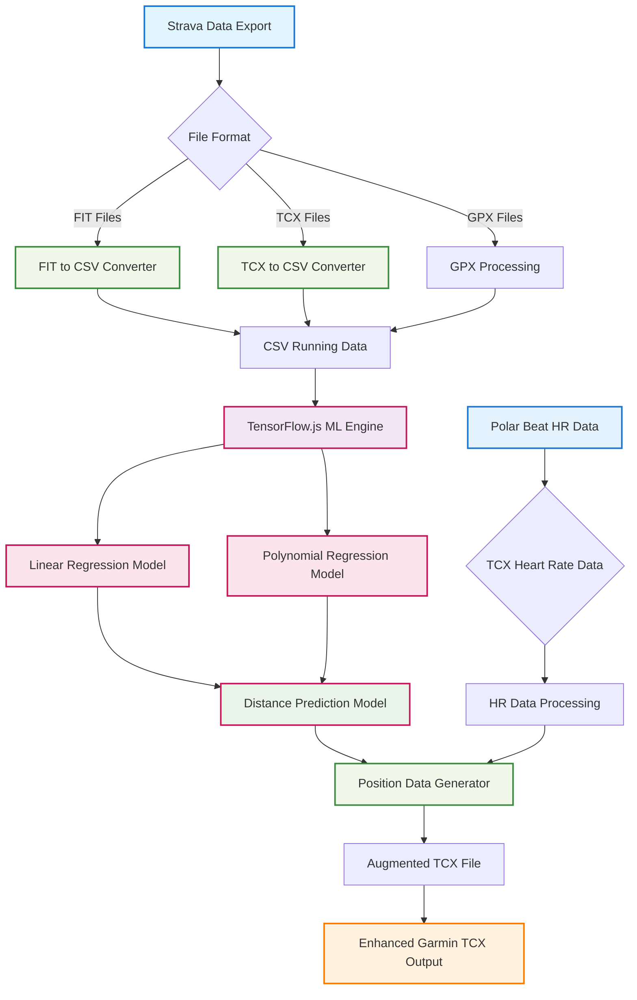

# Polar HR Data to Garmin TCX

Given polar beat data (hr and timings stored *on device*), generate soccer position data. This is not intended to make "fake" data to hack strava, but instead it is meant to fill in the gaps of recording only via heart rate.

Strava and Garmin can only judge training readiness so much. I prefer the Strava algorithm because it uses heart rate data to calculate "Relative Effort". Garmin is not the same. Without location data and distance information, recommendations for workouts or training readiness can be way off. This is meant to help Garmin be a better tool for people doing activities where they can't wear a watch.

## Polar tcx to garmin tcx

`npm run start` to run the application. Takes in a input.tcx that can be specified in the .env.local, and outputs a out.tcx that can be specified in the env.local.

## Strava export-tcx

`npm run export-tcx` to run the application. Currently it doesn't really know what it's doing. Strava doesn't want you slamming there api and they prefer to do bulk export via request. Code is written to get activities and attempt to export via the *frontend*. Sigh, it probably makes sense. Code needs some work.

## Fit to tcx converter

TODO - looking to create an app that converts fit files to the tcx standard so that they can be parsed without needing to be in a binary format that needs a special tool to view

## TCX to CSV

Convert the TCX data to CSV for easier regression data creation

## ML on running CSV data

Running linear/polynomial regression to create a model to better assist polar tcx to garmin tcx
