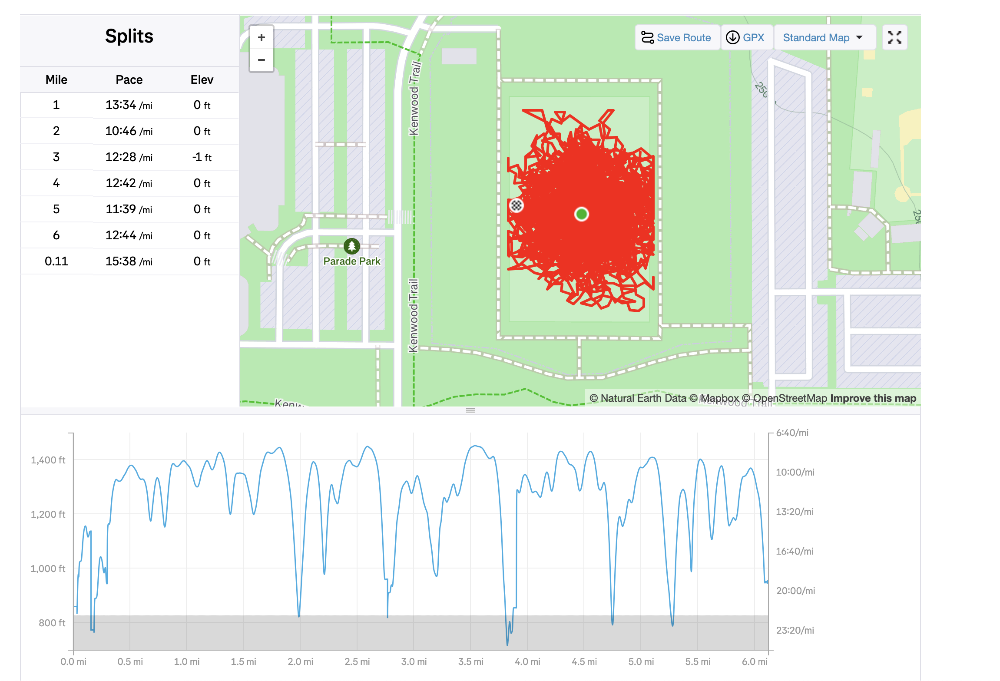

# Polar HR Data to Garmin TCX

Given polar beat data (hr and timings stored *on device*), generate soccer position data. This is not intended to make "fake" data to hack strava, but instead it is meant to fill in the gaps of recording only via heart rate.

Strava and Garmin can only judge training readiness so much. I prefer the Strava algorithm because it uses heart rate data to calculate "Relative Effort". Garmin is not the same. Without location data and distance information, recommendations for workouts or training readiness can be way off. This is meant to help Garmin be a better tool for people doing activities where they can't wear a watch.

